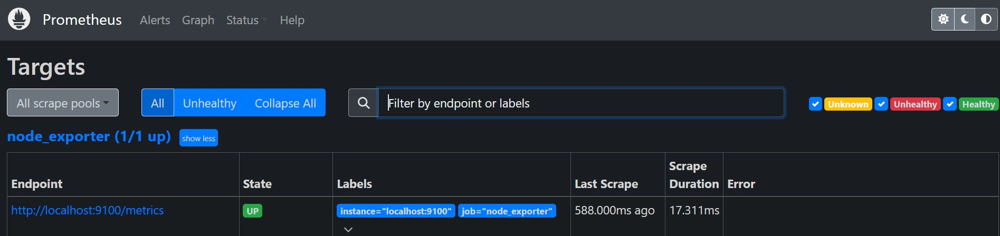
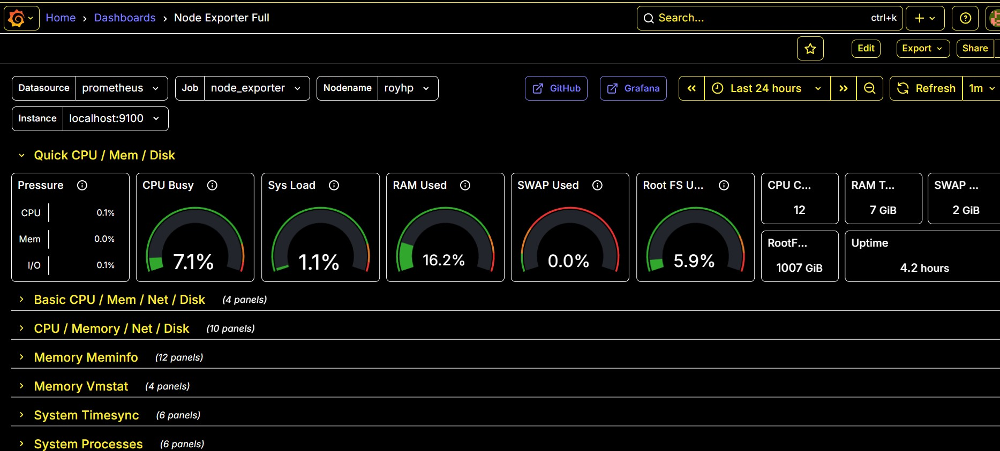
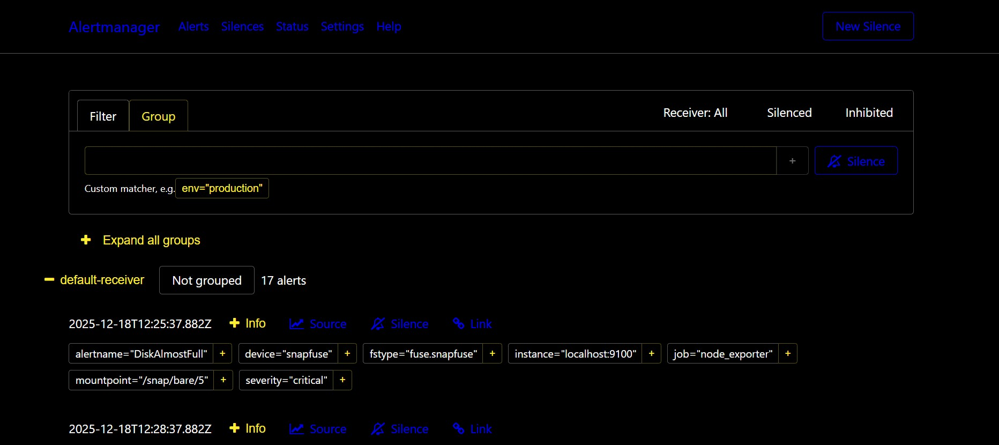

# Linux Monitoring Stack
**Prometheus • Node Exporter • Alertmanager • Grafana**

## Overview
This repository contains a production-style Linux monitoring and alerting stack built using open-source observability tools.  
The project is designed to demonstrate real-world Linux system administration practices, clean filesystem layout, and reproducible documentation suitable for portfolio and interview use.

---

## Architecture
- **Node Exporter** exposes host-level metrics
- **Prometheus** scrapes and stores metrics
- **Alertmanager** handles alert routing and silencing
- **Grafana** visualizes metrics via dashboards

---

## Prerequisites

- Ubuntu 22.04+ or WSL (systemd enabled)
- sudo privileges
- Internet access
- Open local ports:
  - 3000
  - 9090
  - 9093
  - 9100

---

## Installation (High-Level)

Detailed installation steps are documented here:
➡️ **[`docs/installation.md`](docs/installation.md)**

### Components Installed
- Prometheus
- Node Exporter
- Alertmanager
- Grafana

### Installation Standards
- Binaries installed to `/usr/local/bin`
- Configuration files version-controlled in this repository
- Services managed via `systemd`

---

## Service Verification

After installation, verify each component:

| Component       | Check |
|----------------|-------|
| Node Exporter  | http://localhost:9100/metrics |
| Prometheus     | http://localhost:9090/targets |
| Alertmanager   | http://localhost:9093 |
| Grafana        | http://localhost:3000 |

All Prometheus targets should report **UP**.

---

## Port Reference

| Component       | Port |
|-----------------|------|
| Prometheus      | 9090 |
| Node Exporter   | 9100 |
| Alertmanager    | 9093 |
| Grafana         | 3000 |

---

## Screenshots

### Prometheus Targets

### Grafana Dashboard

### Alertmanager UI

### Node Exporter Metrics

---

## Project Structure

linux-monitoring-stack/
├── README.md
├── docs/
│ ├── installation.md
│ └── screenshots/
├── prometheus/
│ └── prometheus.yml
├── alertmanager/
│ └── alertmanager.yml
├── exporters/
│ └── node_exporter/
├── grafana/
│ └── dashboards/
└── systemd/

yaml
Copy code

---

## Notes
- This repository contains **configuration and documentation only**
- No binaries or credentials are committed
- systemd service files are included as reference copies

---

## Author
**Roy Phillip**  
Founder — **WEP Global Tech**